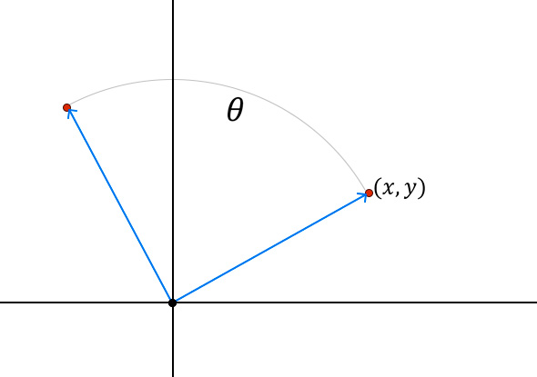

Rotación de puntos cartesianos
================================================

<div style="display: flex; justify-content:center;">
    
</div>

Para rotar un punto $(x,y)$, en un ángulo $\theta$ alrededor del origen en el plano cartesiano, solo tenemos que multiplicar el punto por La matriz de rotación, como se muestra a continuación:

$$\begin{pmatrix}
cos(\theta) & -sin(\theta) \\
sin(\theta) & cos(\theta) 
\end{pmatrix}\cdot
\begin{pmatrix}
x  \\
y
\end{pmatrix}
= \begin{pmatrix}
x \cdot cos(\theta)- y \cdot sin(\theta)  \\
x \cdot sin(\theta) + y \cdot cos(\theta) 
\end{pmatrix}$$

Problema
--------

En el archivo `src\exercise.py` implementar una clase llamada `PuntoCartesiano`:

* El constructor de la clase debe recibir como parámetros las coordenadas $x,y$ de un punto cartesiano, en ese orden, para almacenarlos como los atributos siguientes:
    * `x`: la coordenada $x$ de tipo `float`.
    * `y`: la coordenada $y$ de tipo `float`.
* También debe contener un método con firma `rotar(self, t:float)`.
    * El parámetro `t` debe ser de tipo `float` y representa un ángulo en grados.
    * Dicho método debe transformar los valores de los atributos `x`, `y` de forma que los nuevos valores correspondan a rotar el punto $(x, y)$ en `t` grados alrededor del origen.
    * Redondear los valores a **5 dígitos decimales**.


Validaciones
------------

Ejemplo 1:
```python
>>> p = PuntoCartesiano(-24.9, 74.3) 
>>> p.x, p.y
(-24.9, 74.3)
>>> p.rotar(-146) 
>>> p.x, p.y      
(62.19107, -47.67359)
```

Ejemplo 2:
```python
>>> p = PuntoCartesiano(-2.4, -34.6)     
>>> p.x, p.y
(-2.4, -34.6)
>>> p.rotar(123)  
>>> p.x, p.y     
(30.32514, 16.8317)
```

Ejemplo 3:
```python
>>> p = PuntoCartesiano(-71.1, 63.8) 
>>> p.x, p.y
(-71.1, 63.8)
>>> p.rotar(113) 
>>> p.x, p.y     
(-30.94723, -90.37654)
```
