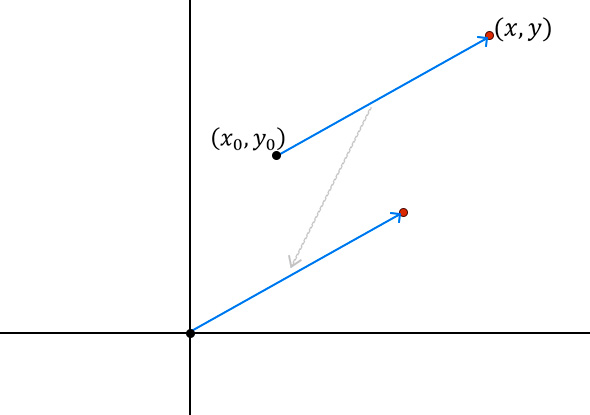

Rotación de puntos cartesianos generalizada
================================================

Si tenemos un vector que va de un punto origen $(x_0, y_0)$ a un punto destino $(x, y)$ y queremos moverlo al origen del plano cartesiano, como se muestra en la imagen, solo basta restar el punto origen al punto destino: $(x,y) - (x_0, y_0)$.

Por otro lado, para devolver el vector al punto origen, solo basta sumar de regreso el punto $(x_0, y_0)$.

<div style="display: flex; justify-content:center;">
    
</div>

Problema
--------

En el archivo `src\exercise.py` implementar una clase llamada `PuntoCartesiano`:

* El constructor de la clase debe recibir como parámetros las coordenadas $x,y$ de un punto cartesiano, en ese orden, para almacenarlos como los atributos siguientes:
    * `x`: la coordenada $x$ de tipo `float`.
    * `y`: la coordenada $y$ de tipo `float`.
* También debe contener un método con firma `rotar_general(self, t:float, p:tuple)`.
    * El parámetro `t` debe ser de tipo `float` y representa un ángulo en grados.
    * El parámetro `p` debe ser una tupla que representa otro punto cartesiano $(x_0, y_0)$.
    * Dicho método debe transformar los valores de los atributos `x`, `y` de forma que los nuevos valores correspondan a rotar el punto $(x, y)$ en `t` grados alrededor del punto cartesiano `p`.
    * Redondear los valores a 5 dígitos decimales.


Validaciones
------------

Ejemplo 1:
```python
>>> p = PuntoCartesiano(-45.3, -65.5) 
>>> p.x, p.y
(-45.3, -65.5)
>>> p.rotar_general(50, (-55.5, 8.0)) 
>>> p.x, p.y
(7.3607, -31.43124)
```

Ejemplo 2:
```python
>>> p = PuntoCartesiano(4.4, 79.4)       
>>> p.x, p.y
(4.4, 79.4)
>>> p.rotar_general(-245, (27.4, 25.7)) 
>>> p.x, p.y
(-11.54851, -17.83968)
```

Ejemplo 3:
```python
>>> p = PuntoCartesiano(-50.8, -65.9) 
>>> p.x, p.y
(-50.8, -65.9)
>>> p.rotar_general(-226, (54.2, 13.8)) 
>>> p.x, p.y
(184.47051, -6.36641)
```
