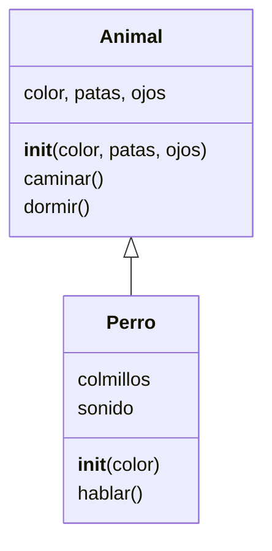

Diagramas de herencia
======================

```mermaid
classDiagram
    class Animal{
        color, patas, ojos
        __init__(color, patas, ojos)
        caminar()
        dormir()
    }
    class Perro{
        colmillos
        sonido
        __init__(color)
        hablar()
    }
    Animal <|-- Perro
```

