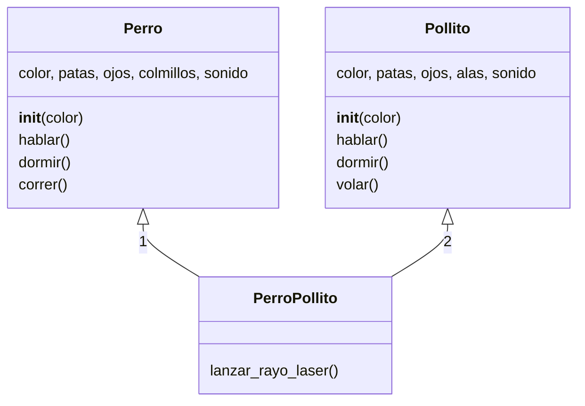

Diagramas de herencia
======================

```mermaid
classDiagram
    class Perro{
        color, patas, ojos, colmillos, sonido
        __init__(color)
        hablar()
        dormir()
        correr()
    }
    class Pollito{
        color, patas, ojos, alas, sonido
        __init__(color)
        hablar()
        dormir()
        volar()
    }
    class PerroPollito{
        lanzar_rayo_laser()
    }
    Perro <|-- PerroPollito: 1
    Pollito <|-- PerroPollito: 2
```

