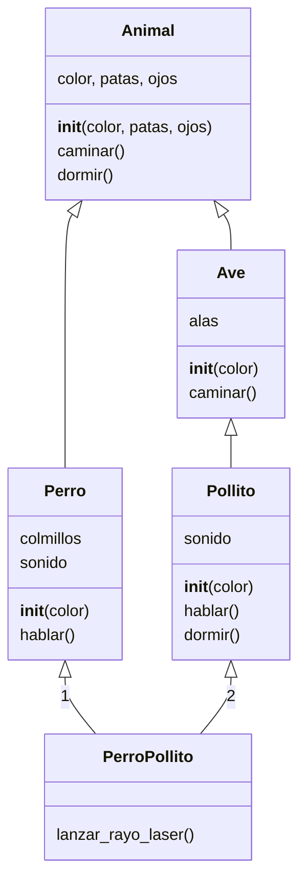

Diagramas de herencia
======================

```mermaid
classDiagram
    class Animal{
        color, patas, ojos
        __init__(color, patas, ojos)
        caminar()
        dormir()
    }
    class Perro{
        colmillos
        sonido
        __init__(color)
        hablar()
    }
    class Ave{
        alas
        __init__(color)
        caminar()
    }
    class Pollito{
        sonido
        __init__(color)
        hablar()
        dormir()
    }
    class PerroPollito{
        lanzar_rayo_laser()
    }
    Animal <|-- Perro
    Animal <|-- Ave
    Ave <|-- Pollito
    Perro <|-- PerroPollito: 1
    Pollito <|-- PerroPollito: 2
```

