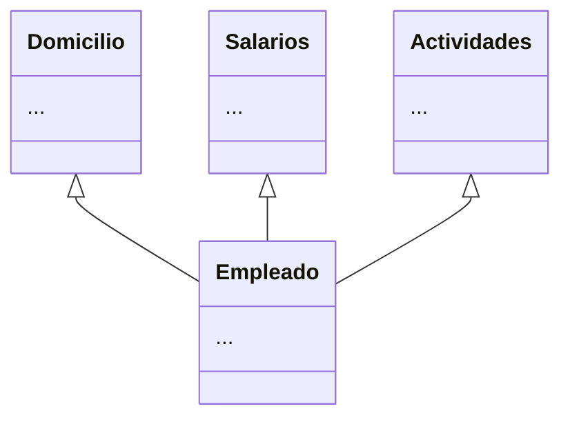
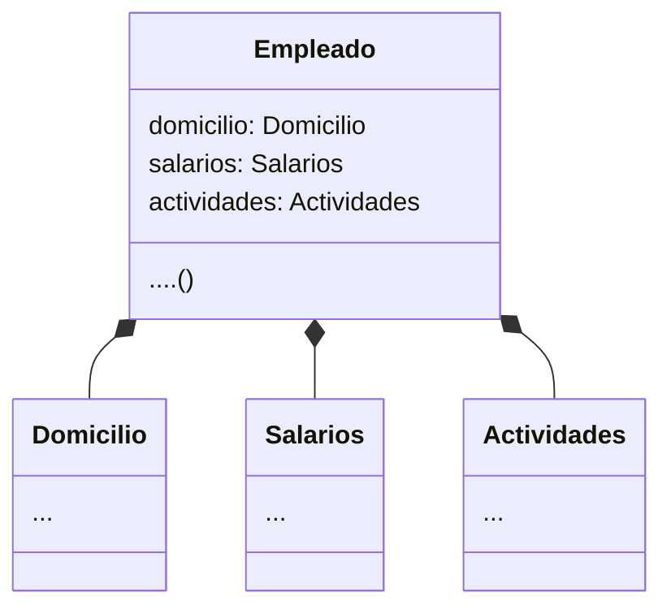

Composición sobre herencias
============================

El mecanismo de composición es cuando una clase **A** se integra a otra a través de un atributo el cual es definido como un objeto de tipo **A**.
* De esta forma quedan dos clases completamente disjuntas las cuales podemos modificar de manera prácticamente independiente una de la otra.
* Lo mejor darle prioridad a la composición antes que a la herencia.

Herencia
---------

Composición
---------

