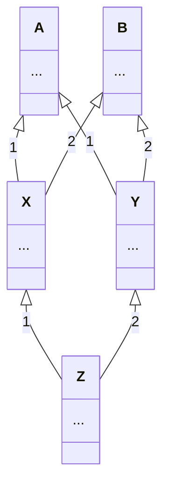

Diagramas de herencia
======================

---------

```mermaid
classDiagram
    class A{
        ...
    }
    class B{
        ...
    }
    class X{
        ...
    }
    class Y{
        ...
    }
    class Z{
        ...
    }
    A <|-- X:1
    B <|-- X:2
    A <|-- Y:1
    B <|-- Y:2
    X <|-- Z:1
    Y <|-- Z:2
```
